## **EXPERIENCE CONTINUOUS INTEGRATION WITH JENKINS | ANSIBLE | ARTIFACTORY | SONARQUBE | PHP**

</br>

A-Install Jenkins

1 connect vscode to remote ec2 instance

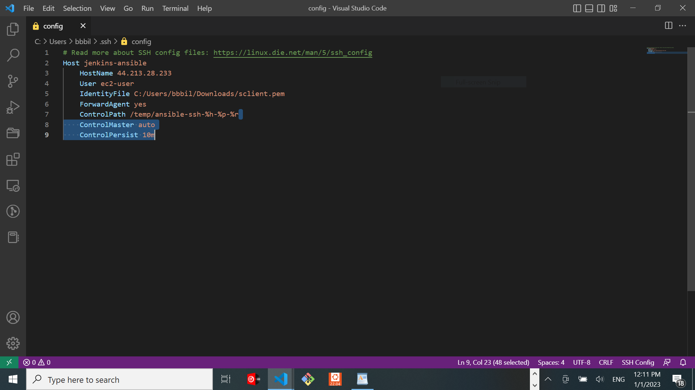
![]

2 install git

3 clone the repository

** `install Jenkins`**

https://www.jenkins.io/doc/book/installing

`sudo su`

```
sudo wget -O /etc/yum.repos.d/jenkins.repo \
    https://pkg.jenkins.io/redhat-stable/jenkins.repo

sudo rpm --import https://pkg.jenkins.io/redhat-stable/jenkins.io.key

# Add required dependencies for the jenkins package EPEL release and Remirepo

sudo yum install -y https://dl.fedoraproject.org/pub/epel/epel-release-latest-8.noarch.rpm

sudo yum install -y dnf-utils http://rpms.remirepo.net/enterprise/remi-release-8.rpm

sudo yum upgrade

## install JAVA

sudo yum install java-11-openjdk-devel -y

##### open the bash profile 

vi .bash_profile 

##### paste the below in the bash profile

export JAVA_HOME=$(dirname $(dirname $(readlink $(readlink $(which javac)))))
export PATH=$PATH:$JAVA_HOME/bin
export CLASSPATH=.:$JAVA_HOME/jre/lib:$JAVA_HOME/lib:$JAVA_HOME/lib/tools.jar

##### reload the bash profile

source ~/.bash_profile

### install jenkins

sudo yum install jenkins

sudo systemctl start jenkins

sudo systemctl enable jenkins

sudo systemctl daemon-reload

```

sudo systemctl status jenkins

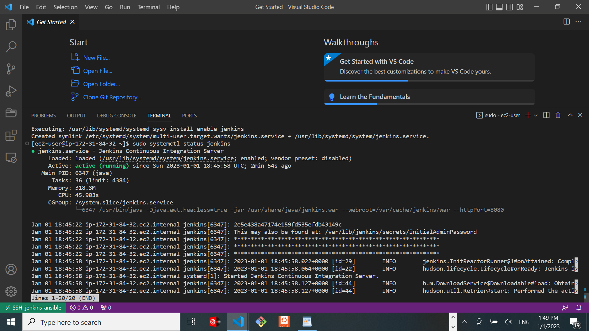

`open port 8080`

http://44.213.28.233:8080/

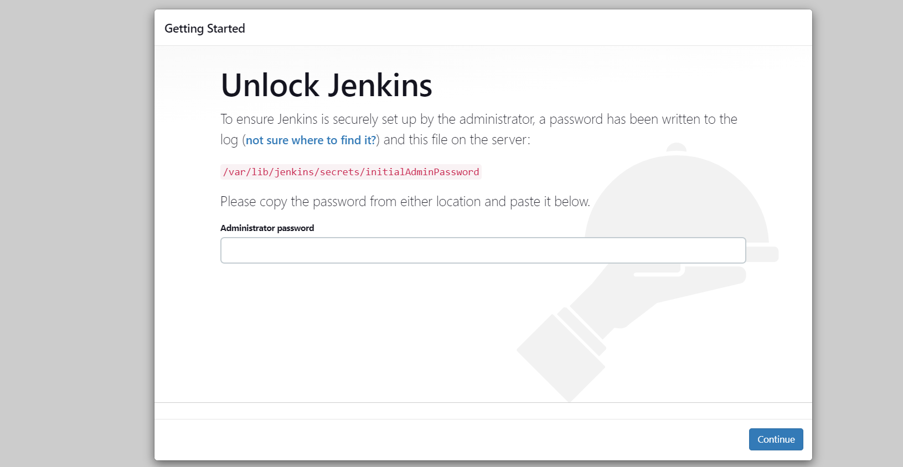


For initial jenkins admin password
 
 `sudo cat /var/lib/jenkins/secrets/initialAdminPassword` 

 install suggested plugings

 B- **Configuring Ansible For JenkinsDeployment**

1-  Navigate to Jenkins URL

2- Install & Open Blue Ocean Jenkins Plugin

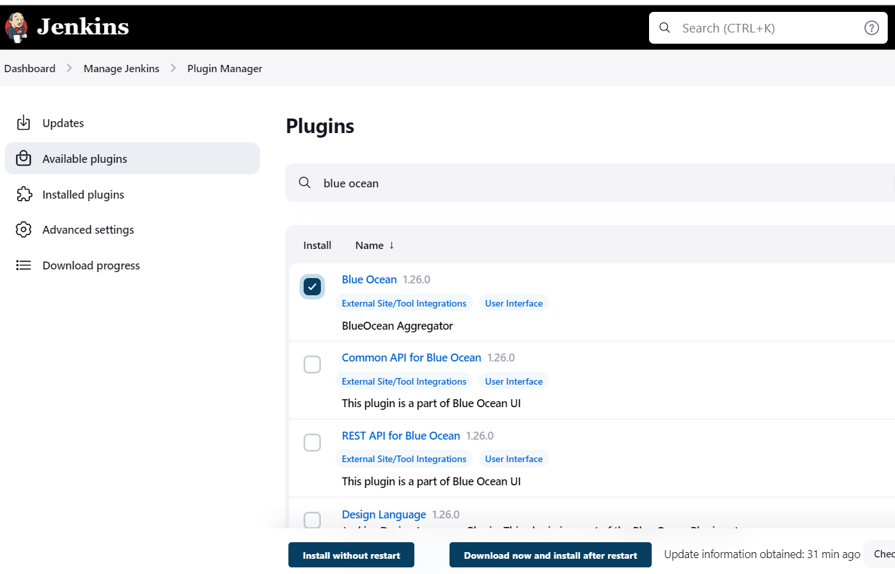

3- Create a new pipeline

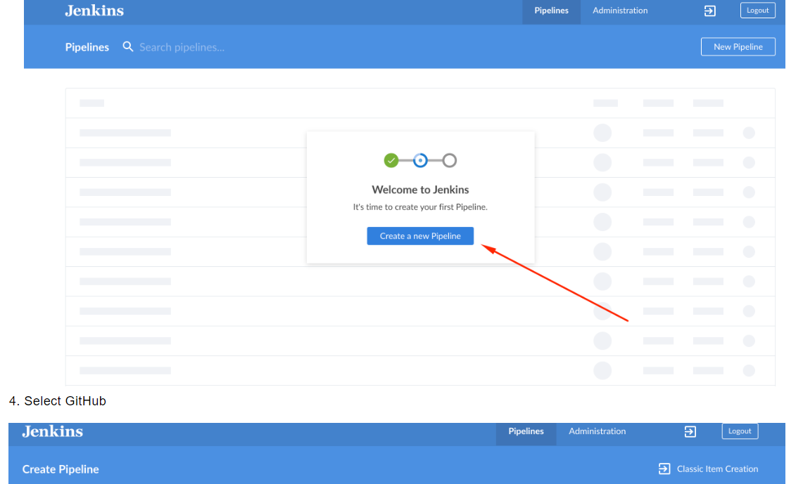

Select GitHub

Connect Jenkins with GitHub

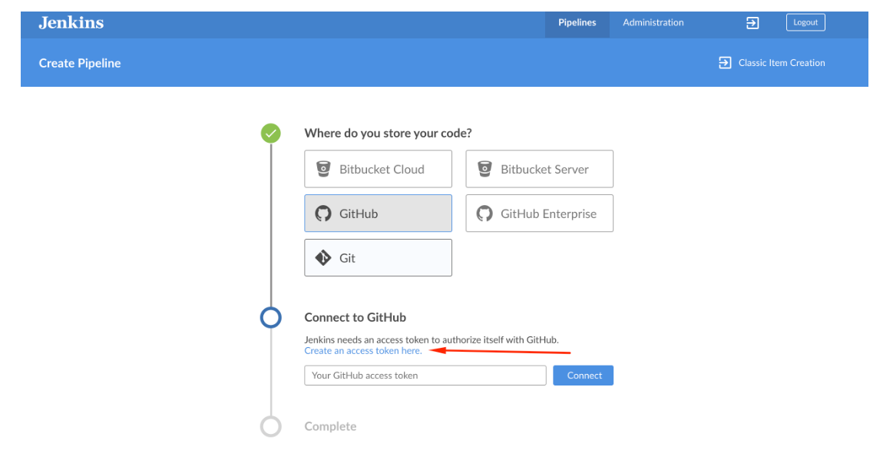

Login to GitHub & Generate an Access Tokenhttps://www.darey.io/wp-content/uploads/2021/07/Jenkins-Create-Access-Token-To-Github.png


Copy Access Token

Paste the token and connect

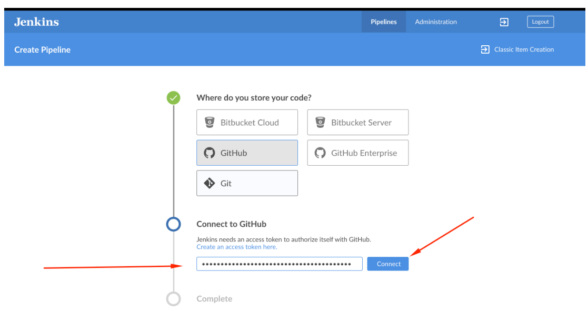

Create a new Pipeline

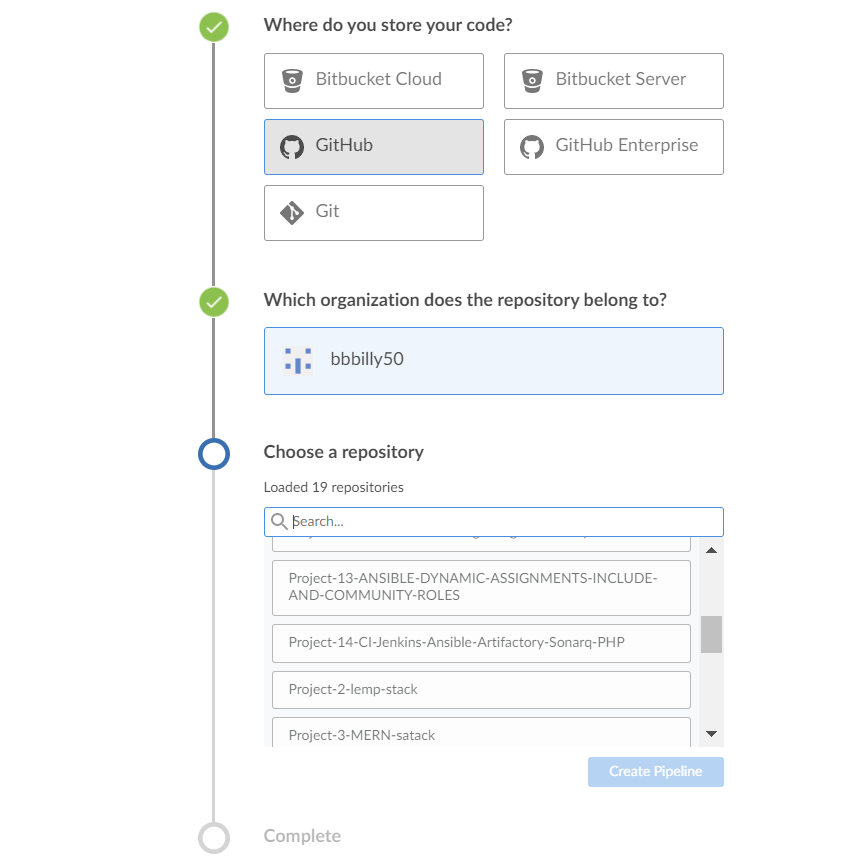

 Click on `Administration` to exit the Blue Ocean console.


Here is our newly created pipeline. It takes the name of your GitHub repository.

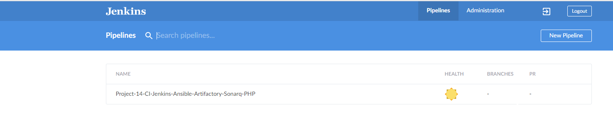

**Let us create our `Jenkinsfile`**

 Inside the Ansible project, create a new directory `deploy` and start a new file `Jenkinsfile` inside the directory.

Add the code snippet below to start building the Jenkinsfile gradually. This pipeline currently has just one stage called Build and the only thing we are doing is using the shell script module to echo Building Stage


```
pipeline {
    agent any

  stages {
    stage('Build') {
      steps {
        script {
          sh 'echo "Building Stage"'
        }
      }
    }
    }
}

```

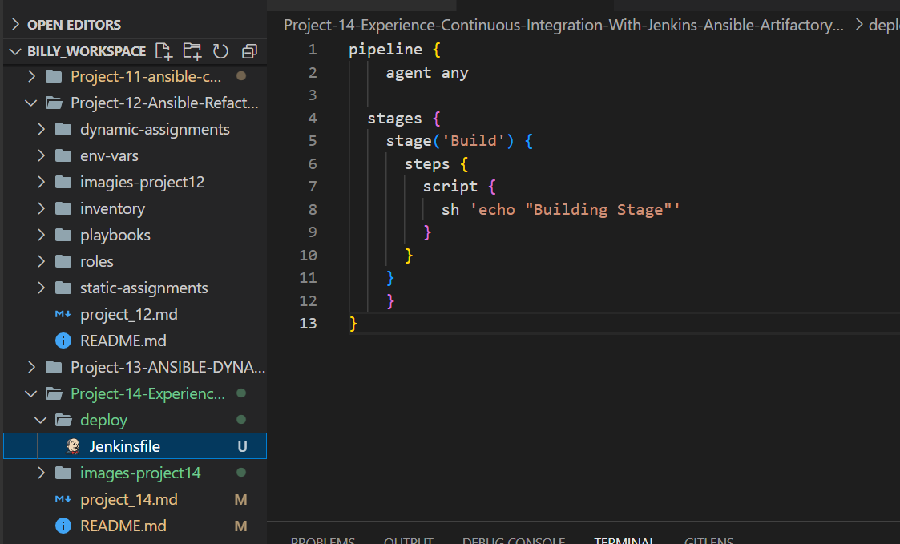


Now go back into the Ansible pipeline in Jenkins, and select `configure`

Scroll down to `Build Configuration` section and specify the location of the Jenkinsfile at `deploy/Jenkinsfile`

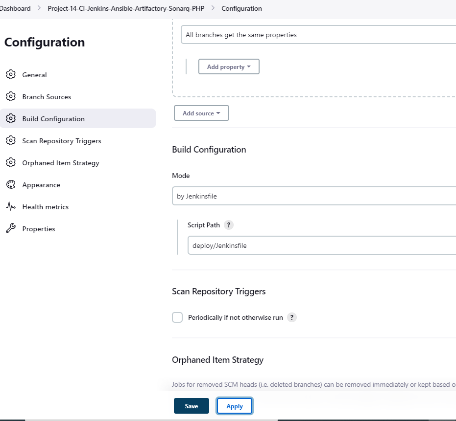


Back to the pipeline again, this time click `"Build now"`

This will trigger a build and you will be able to see the effect of our basic Jenkinsfile configuration by going through the console output of the build.

To really appreciate and feel the difference of Cloud Blue UI, it is recommended to try triggering the build again from `Blue Ocean interface`.

Click on `Blue Ocean`

Select your project
Click on the `play button` against the branch

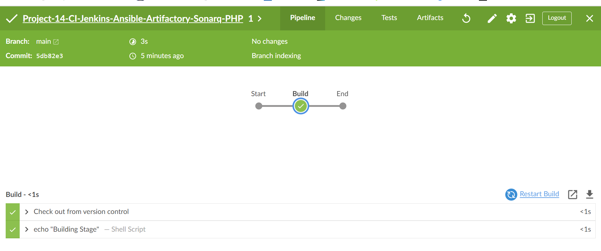

Notice that this pipeline is a `multibranch` one. This means, if there were more than one branch in `GitHub`, `Jenkins` would have scanned the repository to discover them all and we would have been able to trigger a `build` for each `branch`.

Let us see this in action.

Create a new git branch and name it feature/jenkinspipeline-stages
Currently we only have the Build stage. Let us add another stage called Test. Paste the code snippet below and push the new changes to GitHub.

```
   pipeline {
    agent any

  stages {
    stage('Build') {
      steps {
        script {
          sh 'echo "Building Stage"'
        }
      }
    }

    stage('Test') {
      steps {
        script {
          sh 'echo "Testing Stage"'
        }
      }
    }
    }
}

```
To make your new branch show up in Jenkins, we need to tell Jenkins to scan the repository.

Click on the "Administration" button

Navigate to the Ansible project and click on `"Scan repository now"`

Refresh the page and both branches will start building automatically. You can go into Blue Ocean and see both branches there too.

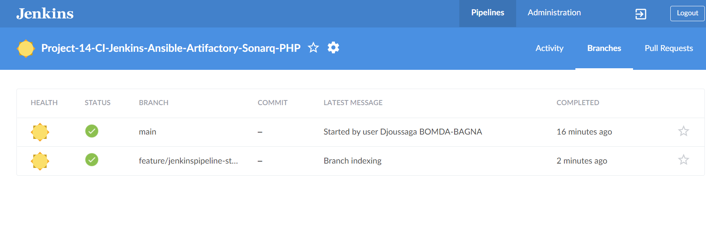

In Blue Ocean, you can now see how the Jenkinsfile has caused a new step in the pipeline launch build for the new branch.

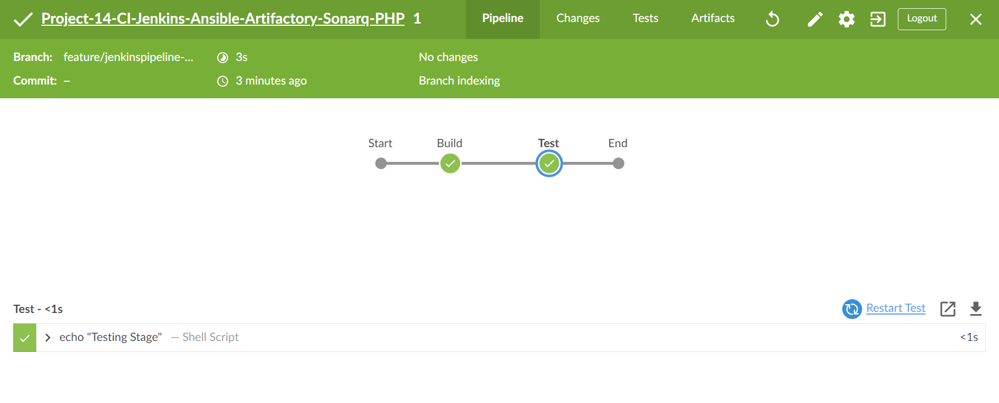

A QUICK TASK FOR YOU!
1. Create a pull request to merge the latest code into the main branch
2. After merging the PR, go back into your terminal and switch into the main branch.
3. Pull the latest change.
4. Create a new branch, add more stages into the Jenkins file to simulate below phases. (Just add an echo command like we have in build and test stages)
   1. Package 
   2. Deploy 
   3. Clean up
5. Verify in Blue Ocean that all the stages are working, then merge your feature branch to the main branch
6. Eventually, your main branch should have a successful pipeline like this in blue ocean

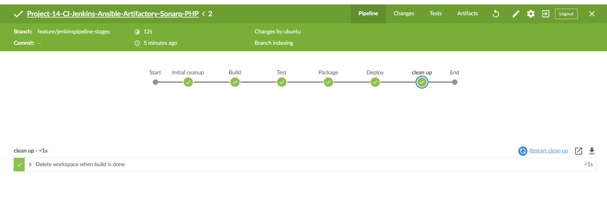

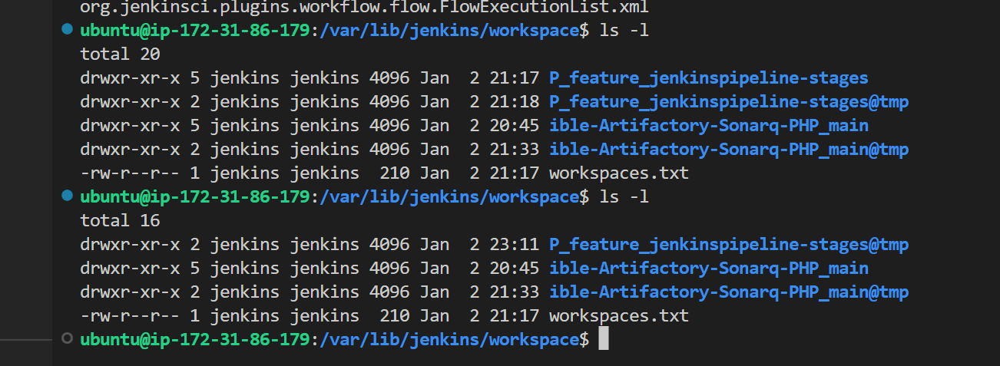

**C-RUNNING ANSIBLE PLAYBOOK FROM JENKINS**

Now that you have a broad overview of a typical Jenkins pipeline. Let us get the actual Ansible deployment to work by:

1. Installing Ansible on Jenkins

2. Installing Ansible plugin in Jenkins UI

3. Creating Jenkinsfile from scratch. (Delete all you currently have in there and start all over to get Ansible to run successfully)

Note: Ensure that Ansible runs against the Dev environment successfully.

**Install ansible**

`sudo yum install ansible -y`

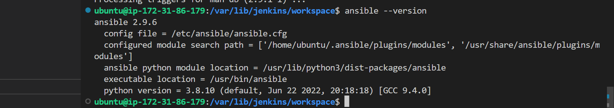

**Install Ansible dependencies**

```
 yum install python3 python3-pip wget unzip git -y

  python3 -m pip install --upgrade setuptools

  python3 -m pip install --upgrade pip

  python3 -m pip install PyMySQL

  python3 -m pip install mysql-connector-python

  python3 -m pip install psycopg2==2.7.5 --ignore-installed
```

### Ansible dependencies to install

**Install ansible community lib**

  **For Mysql Database**

 `ansible-galaxy collection install community.mysql`

* For Postgresql Database
  
`ansible-galaxy collection install community.postgresql`

Go to Jenkins ans install ansible plugin

**Possible errors to watch out for:**

Ensure that the git module in Jenkinsfile is checking out `SCM` to main branch instead of master (GitHub has discontinued the use of Master due to Black Lives Matter. You can read more here)

Jenkins needs to `export the ANSIBLE_CONFIG` environment variable. You can put the .`ansible.cfg` file alongside Jenkinsfile in the deploy directory. This way, anyone can easily identify that everything in there relates to deployment. Then, using the `Pipeline Syntax tool in Ansible`, `generate the syntax` to create environment variables to set.

https://wiki.jenkins.io/display/JENKINS/Building+a+software+project


Possible issues to watch out for when you implement this

Remember that `ansible.cfg` must be `exported to environment variable` so that Ansible knows `where to find Roles`. 

But because you will possibly run Jenkins from `different git branches`, the `location of Ansible roles will change`. Therefore, you must handle this `dynamically`. 

You can use `Linux Stream Editor`  `sed` to update the section `roles_path` each time there is an execution. You may not have this issue if you run only from the main branch.

If you push new changes to Git so that Jenkins failure can be fixed. You might observe that your change may sometimes have no effect. Even though your change is the actual fix required. This can be because Jenkins did not download the latest code from GitHub.

 Ensure that you `start` the `Jenkinsfile` with a `clean up step` to always delete the previous workspace before running a new one.
 
  Sometimes you might need to `login to the Jenkins Linux server to verify the files in the workspace to confirm that what you are actually expecting is there`. Otherwise, you can spend hours trying to figure out why Jenkins is still failing, when you have pushed up possible changes to fix the error.

Another possible reason for Jenkins failure sometimes, is because you have indicated in the Jenkinsfile to `check out the main git branch`, and you are `running a pipeline from another branch`. So, always verify by logging onto the `Jenkins` box to `check` the `workspace`, and run `git branch command` to confirm that the branch you are expecting is there.

If everything goes well for you, it means, the `Dev` environment has an `up-to-date configuration`. 

But what if we need to deploy to other environments?

Are we going to manually update the `Jenkinsfile` to point inventory to those environments? such as `sit`, `uat`, `pentest`, etc.

Or do we need a `dedicated git branch for each environment`, and have the `inventory part` hard coded there.

Think about those for a minute and try to work out which one sounds more like a better solution.

Manually updating the Jenkinsfile is definitely not an option. And that should be obvious to you at this point. Because we try to automate things as much as possible.

Well, unfortunately, we will not be doing any of the highlighted options. What we will be doing is to `parameterise the deployment`. So that at the point of execution, the appropriate values are applied.

**Parameterizing Jenkinsfile For Ansible Deployment**

To `deploy` to other environments, we will need to use `parameters`.

1. Update `sit` inventory with new servers

```PY
[tooling]
<SIT-Tooling-Web-Server-Private-IP-Address>

[todo]
<SIT-Todo-Web-Server-Private-IP-Address>

[nginx]
<SIT-Nginx-Private-IP-Address>

[db:vars]
ansible_user=ec2-user
ansible_python_interpreter=/usr/bin/python

[db]
<SIT-DB-Server-Private-IP-Address>
```

2. `Update Jenkinsfile` to introduce `parameterization`.
   
 Below is just one parameter. It has a default value in case if no value is specified at execution. It also has a description so that everyone is aware of its purpose.

 ```PY
pipeline {
    agent any

    parameters {
      string(name: 'inventory', defaultValue: 'dev',  description: 'This is the inventory file for the environment to deploy configuration')
    }
...
```

3. In the Ansible execution section, remove the hardcoded `inventory/dev` and replace with `${inventory}`
From now on, each time you hit on execute, it will `expect an input`.

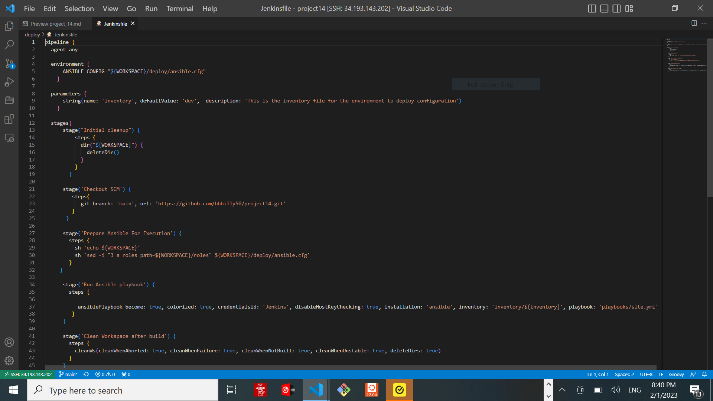


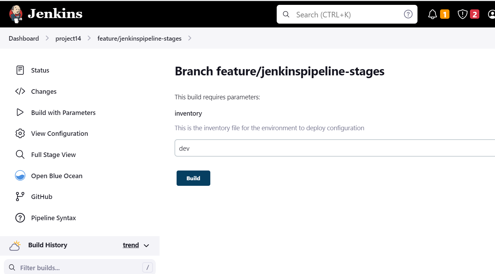

Notice that the `default value` loads up, but we can now specify which environment we want to deploy the configuration to. Simply type sit and hit Run


Add another parameter. This time, `introduce tagging in Ansible``. You can limit the Ansible execution to a specific role or playbook desired`. Therefore, `add an Ansible tag` to run against `webserver only`. Test this locally first to get the experience. Once you understand this, update `Jenkinsfile` and run it from `Jenkins`.


**D.CI/CD PIPELINE FOR TODO APPLICATION**

Our goal here is to `deploy` the application onto servers directly from `Artifactory` rather than from `git`. If you have not updated Ansible with an `Artifactory role`, simply use this guide to create an Ansible role for Artifactory (ignore the Nginx part). 

[Configure Artifactory on Ubuntu 20.04](https://www.howtoforge.com/tutorial/ubuntu-jfrog/)

### **Phase 1 – Prepare Jenkins**

1. Fork the repository below into your GitHub account

`https://github.com/darey-devops/php-todo.git`

2. On you `Jenkins server`,  install `PHP` , its  `dependencies and Composer tool` (Feel free to do this manually at first, then update your Ansible accordingly later)

    **-Install  php (7.4)**

**Step 1: Update**

 `sudo dnf upgrade --refresh`

**Step 2: Import PHP Remi Repository**

 Make sure to import the `appropriate repository` for your `version of CentOS Stream`

 Import Remi PHP Repository for CentOS 9 Stream

 While this is optional for EL9, it is recommended to enable the CRB

 `sudo dnf config-manager --set-enabled crb`

  Install both versions of EPEL for EL9.

```py
  sudo dnf install \
    https://dl.fedoraproject.org/pub/epel/epel-release-latest-9.noarch.rpm \
    https://dl.fedoraproject.org/pub/epel/epel-next-release-latest-9.noarch.rpm
```

Import the EL 9 Remi repository

`sudo dnf install dnf-utils http://rpms.remirepo.net/enterprise/remi-release-9.rpm -y`

To start, use the command below to enable EPEL for 

```
sudo dnf install \
    https://dl.fedoraproject.org/pub/epel/epel-release-latest-8.noarch.rpm \
    https://dl.fedoraproject.org/pub/epel/epel-next-release-latest-8.noarch.rpm
```

Now, use this command to import the Remi EL 8 repository that contains PHP

`sudo dnf install dnf-utils http://rpms.remirepo.net/enterprise/remi-release-8.rpm -y`

**Step 3: Enable PHP Remi Repository**

`dnf module list php`

After that, activate the version of PHP you want to install

- Enable PHP 7.4 on CentOS Stream
  
  `sudo dnf module enable php:remi-7.4 -y`

**Step 4: Install PHP 8.2, 8.1, 8.0 or 7.4**
Now that the Remi PHP repository is enabled, you can set the PHP version you desire as the default on your CentOS Stream system.

Apache (httpd) PHP:

`sudo dnf install php php-cli -y`

Nginx PHP:

`sudo dnf install php-fpm php-cli -y`

`php -v`

`sudo dnf install php-cli php-fpm php-curl php-mysqlnd php-gd php-opcache php-zip php-intl php-common php-bcmath php-imagick php-xmlrpc php-json php-readline php-memcached php-redis php-mbstring php-apcu php-xml php-dom php-redis php-memcached php-memcache`

You can execute the command below at any time to view the currently loaded modules.

`php -m`

Restart your PHP-FPM service.

`sudo systemctl restart php-fpm`

   **-Install COMPOSER**

   `curl -sS https://getcomposer.org/installer | php`

  `sudo mv composer.phar /usr/bin/composer`


For Debian:

    `sudo apt install -y zip libapache2-mod-php phploc php-{xml,bcmath,bz2,intl,gd,mbstring,mysql,zip}`

3. Install Jenkins plugins

  Plot plugin

  Artifactory plugin

We will use plot plugin to display tests reports, and code coverage information.
The Artifactory plugin will be used to easily upload code artifacts into an Artifactory server.

4. In Jenkins UI configure Artifactory


### **Phase 2 – Integrate Artifactory repository with Jenkins**

1. Create a dummy Jenkinsfile in the repository

2. Using `Blue Ocean`, create a multibranch Jenkins pipeline

3. On the database server, create database and user

```py
Create database homestead;
CREATE USER 'homestead'@'%' IDENTIFIED BY 'sePret^i';
GRANT ALL PRIVILEGES ON * . * TO 'homestead'@'%';
```

**Update the database connectivity requirements in the file `.env.sample`**

Update Jenkinsfile with proper pipeline configuration


```py
pipeline {
    agent any

  stages {

     stage("Initial cleanup") {
          steps {
            dir("${WORKSPACE}") {
              deleteDir()
            }
          }
        }

    stage('Checkout SCM') {
      steps {
            git branch: 'main', url: 'https://github.com/darey-devops/php-todo.git'
      }
    }

    stage('Prepare Dependencies') {
      steps {
             sh 'mv .env.sample .env'
             sh 'composer install'
             sh 'php artisan migrate'
             sh 'php artisan db:seed'
             sh 'php artisan key:generate'
      }
    }
  }
}
```

Notice the Prepare Dependencies section

The required file by `PHP` is `.env` so we are `renaming .env.sample to .env`

`Composer` is used by `PHP to install all the dependent libraries` used by the application

`php artisan` uses the `.env` file to `setup the required database objects` – (After successful run of this step, 

`login to the database`, run `show tables` and you will see the `tables being created` for you)

4. Update the `Jenkinsfile` to include Unit tests step
   
```py

    stage('Execute Unit Tests') {
      steps {
             sh './vendor/bin/phpunit'
      } 
    }

```      

### **Phase 3 – Code Quality Analysis**


This is one of the areas where developers, architects and many stakeholders are mostly interested in as far as product development is concerned. As a DevOps engineer, you also have a role to play. Especially when it comes to setting up the tools.

For `PHP` the most commonly tool used for code `quality analysis` is `phploc`. [Read the article here for more](https://matthiasnoback.nl/2019/09/using-phploc-for-quick-code-quality-estimation-part-1/)


The `data produced by phploc` can be `ploted onto graphs in Jenkins`.

1. Add the code analysis step in `Jenkinsfile`. The output of the data will be saved in `build/logs/phploc.csv` file.
   
```py
stage('Code Analysis') {
  steps {
        sh 'phploc app/ --log-csv build/logs/phploc.csv'

  }
}


2. Plot the data using `plot Jenkins plugin`.

This plugin provides generic `plotting` (or graphing) capabilities in `Jenkins`. It will `plot` one or more single values variations across builds in one or more plots. Plots for a particular job (or project) are `configured in the job configuration screen`, where each field has additional help information. `Each plot can have one or more lines (called data series)`. After each build completes the plots’ data series latest values are pulled from the `CSV` file generated by `phploc`.

```py
    stage('Plot Code Coverage Report') {
      steps {

            plot csvFileName: 'plot-396c4a6b-b573-41e5-85d8-73613b2ffffb.csv', csvSeries: [[displayTableFlag: false, exclusionValues: 'Lines of Code (LOC),Comment Lines of Code (CLOC),Non-Comment Lines of Code (NCLOC),Logical Lines of Code (LLOC)                          ', file: 'build/logs/phploc.csv', inclusionFlag: 'INCLUDE_BY_STRING', url: '']], group: 'phploc', numBuilds: '100', style: 'line', title: 'A - Lines of code', yaxis: 'Lines of Code'
            plot csvFileName: 'plot-396c4a6b-b573-41e5-85d8-73613b2ffffb.csv', csvSeries: [[displayTableFlag: false, exclusionValues: 'Directories,Files,Namespaces', file: 'build/logs/phploc.csv', inclusionFlag: 'INCLUDE_BY_STRING', url: '']], group: 'phploc', numBuilds: '100', style: 'line', title: 'B - Structures Containers', yaxis: 'Count'
            plot csvFileName: 'plot-396c4a6b-b573-41e5-85d8-73613b2ffffb.csv', csvSeries: [[displayTableFlag: false, exclusionValues: 'Average Class Length (LLOC),Average Method Length (LLOC),Average Function Length (LLOC)', file: 'build/logs/phploc.csv', inclusionFlag: 'INCLUDE_BY_STRING', url: '']], group: 'phploc', numBuilds: '100', style: 'line', title: 'C - Average Length', yaxis: 'Average Lines of Code'
            plot csvFileName: 'plot-396c4a6b-b573-41e5-85d8-73613b2ffffb.csv', csvSeries: [[displayTableFlag: false, exclusionValues: 'Cyclomatic Complexity / Lines of Code,Cyclomatic Complexity / Number of Methods ', file: 'build/logs/phploc.csv', inclusionFlag: 'INCLUDE_BY_STRING', url: '']], group: 'phploc', numBuilds: '100', style: 'line', title: 'D - Relative Cyclomatic Complexity', yaxis: 'Cyclomatic Complexity by Structure'      
            plot csvFileName: 'plot-396c4a6b-b573-41e5-85d8-73613b2ffffb.csv', csvSeries: [[displayTableFlag: false, exclusionValues: 'Classes,Abstract Classes,Concrete Classes', file: 'build/logs/phploc.csv', inclusionFlag: 'INCLUDE_BY_STRING', url: '']], group: 'phploc', numBuilds: '100', style: 'line', title: 'E - Types of Classes', yaxis: 'Count'
            plot csvFileName: 'plot-396c4a6b-b573-41e5-85d8-73613b2ffffb.csv', csvSeries: [[displayTableFlag: false, exclusionValues: 'Methods,Non-Static Methods,Static Methods,Public Methods,Non-Public Methods', file: 'build/logs/phploc.csv', inclusionFlag: 'INCLUDE_BY_STRING', url: '']], group: 'phploc', numBuilds: '100', style: 'line', title: 'F - Types of Methods', yaxis: 'Count'
            plot csvFileName: 'plot-396c4a6b-b573-41e5-85d8-73613b2ffffb.csv', csvSeries: [[displayTableFlag: false, exclusionValues: 'Constants,Global Constants,Class Constants', file: 'build/logs/phploc.csv', inclusionFlag: 'INCLUDE_BY_STRING', url: '']], group: 'phploc', numBuilds: '100', style: 'line', title: 'G - Types of Constants', yaxis: 'Count'
            plot csvFileName: 'plot-396c4a6b-b573-41e5-85d8-73613b2ffffb.csv', csvSeries: [[displayTableFlag: false, exclusionValues: 'Test Classes,Test Methods', file: 'build/logs/phploc.csv', inclusionFlag: 'INCLUDE_BY_STRING', url: '']], group: 'phploc', numBuilds: '100', style: 'line', title: 'I - Testing', yaxis: 'Count'
            plot csvFileName: 'plot-396c4a6b-b573-41e5-85d8-73613b2ffffb.csv', csvSeries: [[displayTableFlag: false, exclusionValues: 'Logical Lines of Code (LLOC),Classes Length (LLOC),Functions Length (LLOC),LLOC outside functions or classes ', file: 'build/logs/phploc.csv', inclusionFlag: 'INCLUDE_BY_STRING', url: '']], group: 'phploc', numBuilds: '100', style: 'line', title: 'AB - Code Structure by Logical Lines of Code', yaxis: 'Logical Lines of Code'
            plot csvFileName: 'plot-396c4a6b-b573-41e5-85d8-73613b2ffffb.csv', csvSeries: [[displayTableFlag: false, exclusionValues: 'Functions,Named Functions,Anonymous Functions', file: 'build/logs/phploc.csv', inclusionFlag: 'INCLUDE_BY_STRING', url: '']], group: 'phploc', numBuilds: '100', style: 'line', title: 'H - Types of Functions', yaxis: 'Count'
            plot csvFileName: 'plot-396c4a6b-b573-41e5-85d8-73613b2ffffb.csv', csvSeries: [[displayTableFlag: false, exclusionValues: 'Interfaces,Traits,Classes,Methods,Functions,Constants', file: 'build/logs/phploc.csv', inclusionFlag: 'INCLUDE_BY_STRING', url: '']], group: 'phploc', numBuilds: '100', style: 'line', title: 'BB - Structure Objects', yaxis: 'Count'

      }
    }

```

You should now seen a `Plot menu` item on the left menu. `Click on it to see the charts`. (The analytics may not mean much to you as it is meant to be read by developers. So, you need not worry much about it – this is just to give you an idea of the real-world implementation).